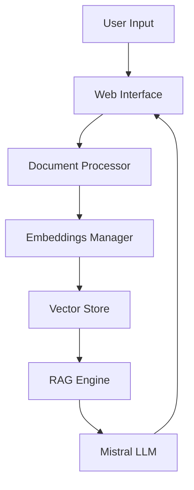

# 📚 RAG with Mistral - Technical Documentation

## Table of Contents
- [Overview](#overview)
- [System Architecture](#system-architecture)
- [Core Components](#core-components)
- [Technical Deep Dive](#technical-deep-dive)
- [Implementation Details](#implementation-details)
- [Performance Considerations](#performance-considerations)
- [Future Enhancements](#future-enhancements)

## Overview

RAG with Mistral is a sophisticated Question-Answering system that combines the power of Retrieval-Augmented Generation (RAG) with the Mistral language model. The system processes documents locally, creating semantic embeddings for efficient retrieval and generating contextually relevant answers.

### Key Technologies Used
- **Mistral LLM**: Open-source language model via Ollama
- **LangChain**: Framework for LLM application development
- **Sentence Transformers**: For document embeddings
- **Chroma DB**: Vector store for document embeddings
- **Streamlit**: Web interface framework

## System Architecture

The system follows a modular architecture with four main components:

1. **Document Processing** (`DocumentProcessor`)
2. **Embeddings Management** (`EmbeddingsManager`)
3. **RAG Engine** (`RAGEngine`)
4. **Web Interface** (`stmain.py`)



## Core Components

### 1. Document Processor
```python
class DocumentProcessor:
    def __init__(self, directory_path: str):
        self.text_splitter = RecursiveCharacterTextSplitter(
            chunk_size=1000,
            chunk_overlap=200,
            separators=["\n\n", "\n", ".", "!", "?", ",", " "]
        )
```
The DocumentProcessor handles:
- Document loading from various formats
- Text chunking with optimal overlap
- Document metadata management

### 2. Embeddings Manager
```python
class EmbeddingsManager:
    def __init__(self, persist_directory: str):
        self.embeddings = SentenceTransformerEmbeddings(
            model_name="all-MiniLM-L6-v2"
        )
```
Features:
- Generates semantic embeddings using Sentence Transformers
- Manages vector store creation and persistence
- Handles document retrieval optimization

### 3. RAG Engine
```python
class RAGEngine:
    def __init__(self, vector_store):
        self.llm = Ollama(
            model="mistral",
            temperature=self.temperature
        )
```
Capabilities:
- Integrates with Mistral LLM via Ollama
- Manages retrieval-augmented generation
- Handles prompt engineering and response generation

## Technical Deep Dive

### Document Processing Pipeline

1. **Text Chunking**
   ```python
   # Chunk size of 1000 characters with 200 character overlap
   chunk_size=1000,
   chunk_overlap=200
   ```
   - Ensures context preservation across chunks
   - Optimizes for retrieval accuracy

2. **Embedding Generation**
   - Uses all-MiniLM-L6-v2 model
   - 384-dimensional embeddings
   - Optimized for semantic similarity

3. **Vector Store Management**
   ```python
   vector_store = Chroma.from_documents(
       documents=documents,
       embedding=self.embeddings,
       persist_directory=self.persist_directory
   )
   ```

### Question-Answering Flow

1. **Query Processing**
   - User input is processed through the RAG engine
   - Context retrieval based on semantic similarity

2. **Context Assembly**
   ```python
   prompt_template = """
   Use the following pieces of context to answer the question.
   Context: {context}
   Question: {question}
   """
   ```

3. **Response Generation**
   - Retrieves relevant context
   - Generates response using Mistral
   - Ensures factual accuracy

## Implementation Details

### Performance Optimizations

1. **Chunking Strategy**
   - Balanced chunk size for optimal retrieval
   - Overlap prevents context loss

2. **Vector Search**
   - k-NN search for relevant documents
   - Configurable context window

3. **Caching**
   - Embeddings are cached
   - Session state management

### Error Handling

```python
try:
    response = self.qa_chain({"query": question})
    return response["result"]
except Exception as e:
    logger.error(f"Error generating answer: {str(e)}")
    raise
```

## Performance Considerations

1. **Memory Management**
   - Efficient document chunking
   - Optimized vector storage

2. **Response Time**
   - Asyncio for non-blocking operations
   - Efficient context retrieval

3. **Scalability**
   - Modular design for easy scaling
   - Configurable parameters

## Future Enhancements

1. **Planned Features**
   - Multi-modal document support
   - Advanced caching mechanisms
   - Response streaming

2. **Optimization Areas**
   - Enhanced chunking strategies
   - Improved embedding models
   - Advanced prompt engineering

---
